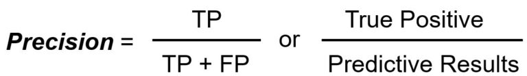
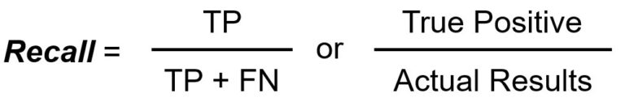
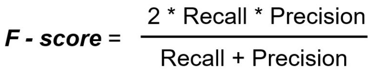
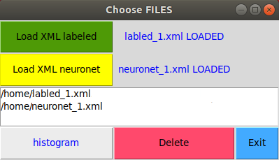
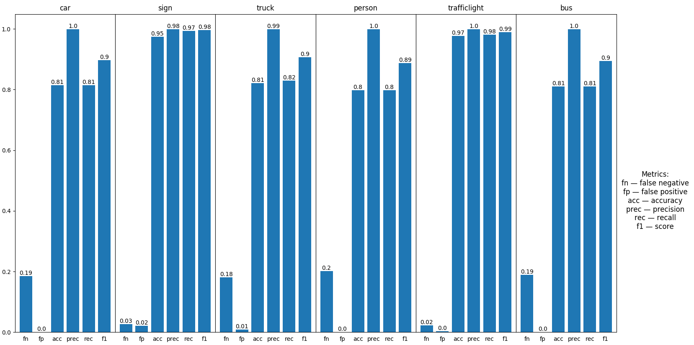
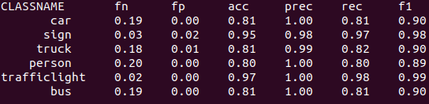

# Аннотация
GUI приложение показывающее метрики для обнаружения объектов на основе xml файлов.

## Поддерживаемые платформы
* Linux 

## Требования:
* python3, библиотеки:
  * sys
  * os
  * numpy
  * numpy
  * tkinter
  * matplotlib
  * xml

# Описание
Приложение предоставляет простые в использовании функции, реализующие те же метрики, которые используются в самых популярных источниках по обнаружению объектов . Реализация была тщательно сравнена с официальной реализацией, и полученные результаты совпадают с официальными результатами.

## Определения 

### Метрика степени пересечения между двумя ограничивающими рамками (IOU)

Для того, чтобы определить пересечения между двумя регионами изображения будет использоваться метрика Intersection over Union (IOU). Она считается довольно просто: площадь пересечения двух областей (area of overlap) делится на общую площадь объединения регионов (area of union). Изображение ниже иллюстрирует IOU, где исходный объект отмечен зеленым прямоугольником и обнаруженный объект красным прямоугольником.

<p align="center">

</p>

### Оценка качества в задачах классификации
* TP — истино-положительное решение. Обнаружение при условии IOU ≥ _порог_  
* TN — истино-отрицательное решение. Обнаружение при условии IOU < _порог_ 
* FP — ложно-положительное решение
* FN — ложно-отрицательное решение

_порог_: в зависимости от метрики, он обычно устанавливается на 50%, 75% или 95%.

### Accuracy (правильность)

Правильность - доля правильных ответов алгоритма.

<p align="center">

</p>

### Precision (точность)
Точность системы в пределах класса – это процентов объектов действительно принадлежащих данному классу относительно всех документов которые система отнесла к этому классу. 
<p align="center">

</p>

### Recall (полнота)
Полнота системы – это процент найденных классификатором объектов принадлежащих классу относительно всех объектов этого класса в тестовой выборке.

<p align="center">

</p>

### F1-socre
Гармоническое среднее между точностью и полнотой.

<p align="center">

</p>

### Запуск
```
python3 gui.py
```

<p align="center">

</p>

Пользователю предлагается загрузить 2 xml файла: исходный файл source local (load xml labled), а также размеченный нейросетью (load xml nerounet). Результаты работы представлены ниже на рисунках для классов: car, sign, truck, person, trafficlight, bus.

<p align="center">

</p>

<p align="center">

</p>


